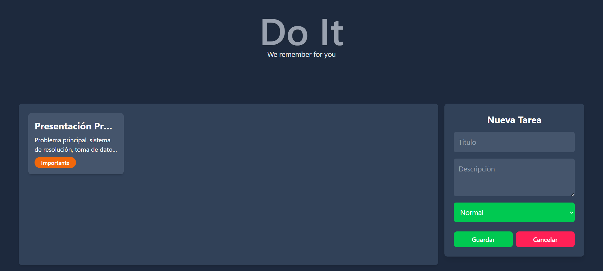

# 📝 ToDo App - Task Manager  

*A sleek task management application built with React, JavaScript, and Tailwind CSS.*  

---

## ✨ Features  

### 🖥️ **Intuitive Interface**  
- Tasks displayed as **rectangular cards** for clear visibility.  
- **Side panel form** to add new tasks (title, description, priority).  
- **Batch delete** with multi-select checkboxes.  

### 🔍 **Detailed Task Management**  
- Click any task to open a **detailed modal** (full description + priority).  
- Modal actions: **Add** ✏️, **Delete** 🗑️, or **Cancel** ❌.
-  `localStorage` persistence.  

### 🌈 **Responsive Design**  
- Fully mobile-friendly with **Tailwind CSS**.  
- Clean, minimalist UI.  

---

## 🛠️ Technologies  
- **React** (Hooks, State Management)  
- **JavaScript ES6+**  
- **Tailwind CSS** (Styling)  

---

## 🚀 Perfect For...  
Organizing daily tasks with **zero fuss** and **maximum efficiency**.  

---

## 🔮 Future Improvements  
- Priority filters/search.  

---

 
